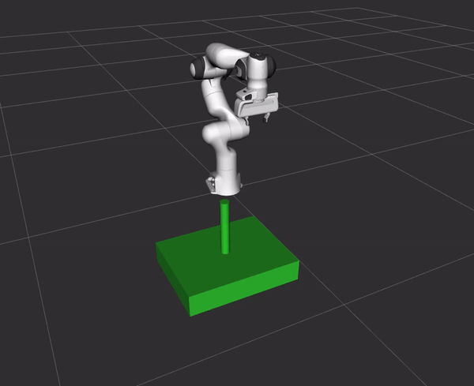

# Deep Grasp Demo


## Overview
Demo showing how to use the Grasp Pose Detection (GPD) library within a grasp pose generator stage of the MoveIt Task Constructor.

This branch interfaces with GPD using ROS messages.

## Install
Complete the [Getting Started Tutorial](https://ros-planning.github.io/moveit_tutorials/doc/getting_started/getting_started.html)

    wstool init
    wstool merge https://raw.githubusercontent.com/PickNikRobotics/deep_grasp_demo/gpd_ros/.rosinstall
    wstool update

    rosdep install --from-paths . --ignore-src --rosdistro $ROS_DISTRO

    catkin build

## Run
### Grasp Pose Detection and MTC Panda demo
```
roslaunch deep_grasp_demo gpd_demo.launch
```

## Results
<p align="center">
  
</p>
