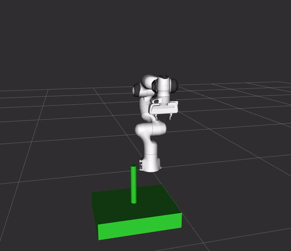
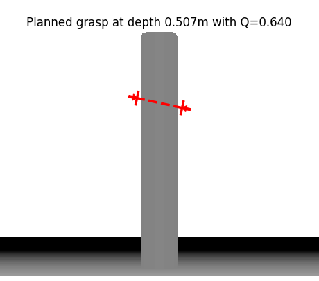
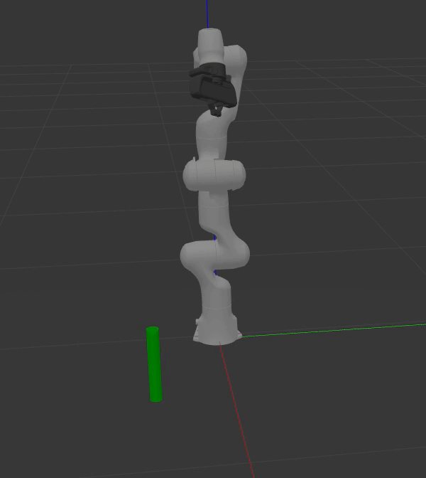
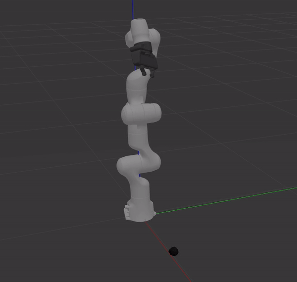
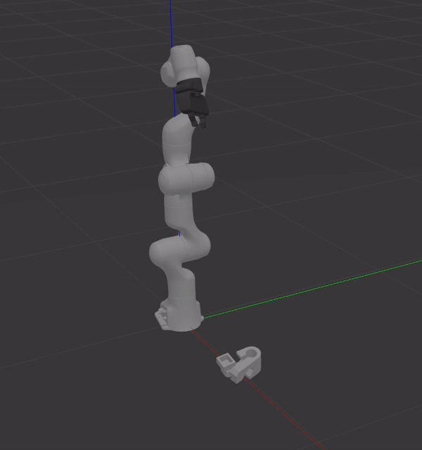
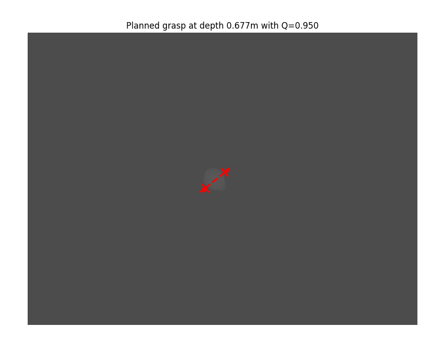
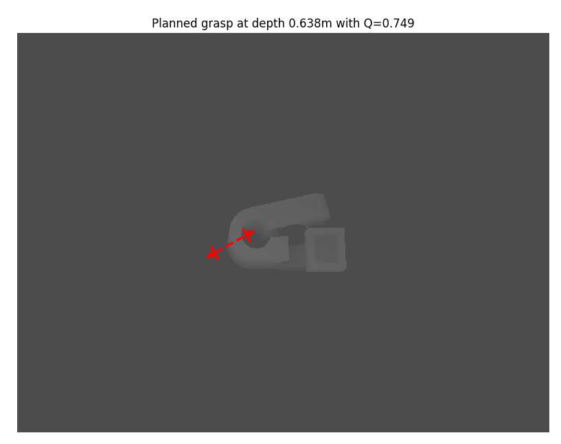

# MoveIt Task Constructor Dex-Net


1) [Overview](#Overview) </br>
2) [Running](#Running) </br>
3) [Nodes](#Nodes) </br>
4) [Tips](#Tips) </br>
5) [Results](#Results) </br>

## Overview
Demo showing how to use Dex-Net for grasp pose generation within the MoveIt Task Constructor. Dex-Net uses a grasp quality CNN (GQ-CNN) to compose the probability a grasp candidate will be successful. The inputs are a color and a depth image and outputs a list of the grasp candidates and their probabilities of success.

The process of sampling grasps using Dex-Net is messy because the library is written in python 2 which is not officially supported in ROS Melodic. The `grasp_image_detection` node calls the `gqcnn_grasp` service offered by the `gqcnn_server` node which returns the grasp candidates. The `gqcnn_server` node interacts with a python 3 `grasp_detector` script running the Dex-Net 4.0 policy. The images are saved by the `process_image_server` node and the files are then loaded by `grasp_detector` script.


## Running
### Using Fake Controllers
You don't need Gazebo for this one. The images for the cylinder were collected ahead of time and located in `data/images/depth_cylinder.png` and `data/images/rgb_cylinder.png`.

To run the pick and place demo:
```
roslaunch moveit_task_constructor_demo demo.launch
roslaunch moveit_task_constructor_dexnet dexnet_demo.launch
```

### Using Gazebo
This demo allows you to execute the motion plan in Gazebo. You have the option to load the images from a file or use the simulated depth camera. The `load_images` argument in `dexnet_demo.launch` specifies whether or not to load the images from a file. Set `load_images:=false` to use the simulated depth camera. Both the `color_image_file` and `depth_image_file` arguments in `dexnet_demo.launch` specify the name of the color and depth images to load.

launch the robot in Gazebo:
```
roslaunch deep_grasp_task gazebo_pick_place.launch
```

**Important Note:** It is recommended to use the provided images for the cylinder demo. The Dex-Net data set contains only images using a downward facing camera, therefore, the GQ-CNN works best using images taken from above. The provided images of the cylinder have been tested and work with this demo. If you use set `load_images:=false` the demo is less likely to work. However, if you change the camera position to overhead as described in the `Camera View Point` section and use a different object such as the bar clamp then Dex-Net will perform better when `load_images:=false`.

To run the pick and place demo:
```
roslaunch moveit_task_constructor_dexnet dexnet_demo.launch
```


## Nodes
### grasp_image_detection
This node bridges the gap between Dex-Net and the MoveIt Task Constructor. Communication with the MoveIt Task Constructor is achieved using ROS action messages. The action client sends the grasp candidates along with the costs back to the `DeepGraspPose` stage. When an action goal is received the `gqcnn_grasp` service is called and the grasp candidates from Dex-Net are received. The images can either be loaded from a file or the node will call the `save_images` service to collect the data.

### gqcnn_server
This node interacts with a python 3 `grasp_detector` script running the Dex-Net 4.0 policy. The `grasp_detector` script is executed as a subprocess to the node and communication with the node is achieved through a Unix Pipe. This node offers a `gqcnn_grasp` service that returns the sampled grasps and their probabilities of success.

### process_image_server
This node is used primarily to save images. It subscribes to color and depth image topic names of type `sensor_msgs/Image`. It offers a `save_images` service that will save the color and depth images to the user specified file names.


## Tips
Adjust some of the parameters in `gqcnn/cfg/examples/replication/dex-net_4.0_pj.yaml`. The `num_seed_samples` parameter determines how many grasps are sampled from the depth image. The `deterministic` parameter will deterministically sample the grasp candidates. Set this to 0 to get different results.


## Results
The output to the cylinder demo using fake controller should look like this.

<p align="center">
  
</p>

Here is the highest ranked grasp candidate with a 64% probability of success. When the images are taken overhead this probability is better.

<p align="center">
  
</p>

Panda picking up the cylinder in Gazebo.

<p align="center">
  
</p>

Now lets try a few more difficult objects, first, the strawberry.

<p align="center">
  
</p>

The most difficult to grasp is the bar clamp.

<p align="center">
  
</p>

Here are the highest ranked grasp candidates for the strawberry and bar clamp viewed from above.

<p align="center">
  
  
</p>
