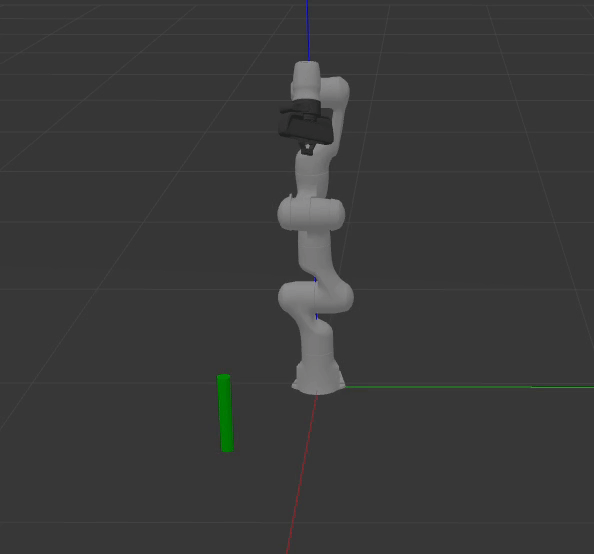
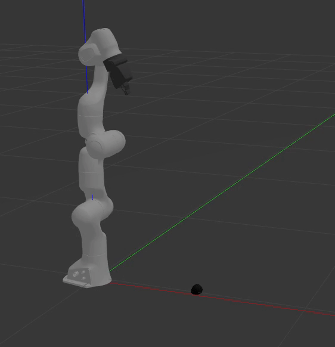
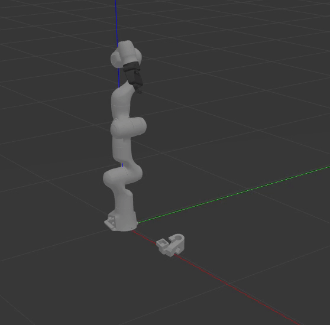
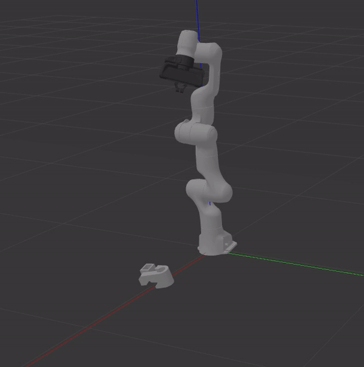
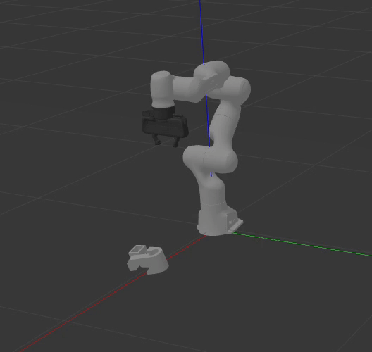

# MoveIt Task Constructor Grasp Pose Detection


1) [Overview](#Overview) </br>
2) [Running](#Running) </br>
3) [Nodes](#Nodes) </br>
4) [Tips](#Tips) </br>
5) [Results](#Results) </br>

## Overview
Demo shows how to use the Grasp Pose Detection (GPD) library within the MoveIt Task Constructor. GPD samples grasp candidates within a point cloud and returns a list of the candidates and their costs.

## Running
### Using Fake Controllers
You don't need Gazebo for this one. The point cloud data for the cylinder was collected ahead of time and located in `data/pointclouds/cylinder.pcd`

To run the pick and place demo:
```
roslaunch moveit_task_constructor_demo demo.launch
roslaunch moveit_task_constructor_gpd gpd_demo.launch
```

### Using Gazebo
This demo allows you to execute the motion plan in Gazebo. You have the option to load the point cloud data from a file or use the simulated depth camera. The `path_to_pcd_file` argument in `gpd_demo.launch` specifies the point cloud that will be used.
The `load_cloud` argument in `gpd_demo.launch` specifies whether or not to load the point cloud from a file. Set `load_cloud:=false` to use the simulated depth camera.

Launch the robot in Gazebo:
```
roslaunch deep_grasp_task gazebo_pick_place.launch
```

To run the pick and place demo:
```
roslaunch moveit_task_constructor_gpd gpd_demo.launch
```

## Nodes
### grasp_cloud_detection
This node uses GPD to sample grasp candidates from a point cloud. Communication with the MoveIt Task Constructor is achieved using ROS action messages. The action client sends the grasp candidates along with the costs back to the `DeepGraspPose` stage. The point cloud can either be loaded from a file or the node can subscribe to the point cloud topic name of type `(sensor_msgs/PointCloud2)` specified as an input parameter. If subscribing to a point cloud topic, the table plane is removed and the resulting point cloud is published on `segmented_cloud`.

### point_cloud_server
This node is primarily used for collecting point cloud data. The `save_point_cloud` service is offered to save point clouds to the user specified file. The node subscribes to the point cloud topic name of type `(sensor_msgs/PointCloud2)` specified as an input parameter. This node also offers the functionality to keep points within specified cartesian lower and upper bounds. Additionally, the table plane can be removed from the point cloud specified by the `remove_table` parameter. The resulting point cloud is published on `filtered_cloud`.

## Tips
If you are processing the point clouds on your own, it is recommended to remove the table plane. GPD will find grasp candidates that try to pick up the object by the table plane. Sometimes segmentation is not enough and GPD tries to grasp other pieces of a point cloud that are not the object. Other portions of the point cloud can be removed using PCL's `filter()` function. This allows you to specify cartesian limits on which points to keep. See the `removeTable()` and `passThroughFilter()` functions in `cloud_utils.cpp.`

## Results
The output to the cylinder demo using fake controller should look like this.

<p align="center">
  
</p>

You may notice that picking up objects on Gazebo is more difficult. I was not able to successfully pick and place any of the tested objects in Gazebo.
In the example bellow 30 points from the point cloud were sampled by GPD.

<p align="center">
  
  
</p>


Other objects such as the strawberry and the bar clamp where tested and GPD was unsuccessful. With the strawberry, 30 points were sampled here as well. I noticed the grasp candidates were usually unable to create a force closure.

<p align="center">
  
</p>


In the example below 30 points from the point cloud were sampled by GPD.

<p align="center">
  
  
</p>

Finally, 500 points were sampled from the bar clamp's point cloud. This grasp candidate appears close to the one Dex-Net selects.

<p align="center">
  
</p>
